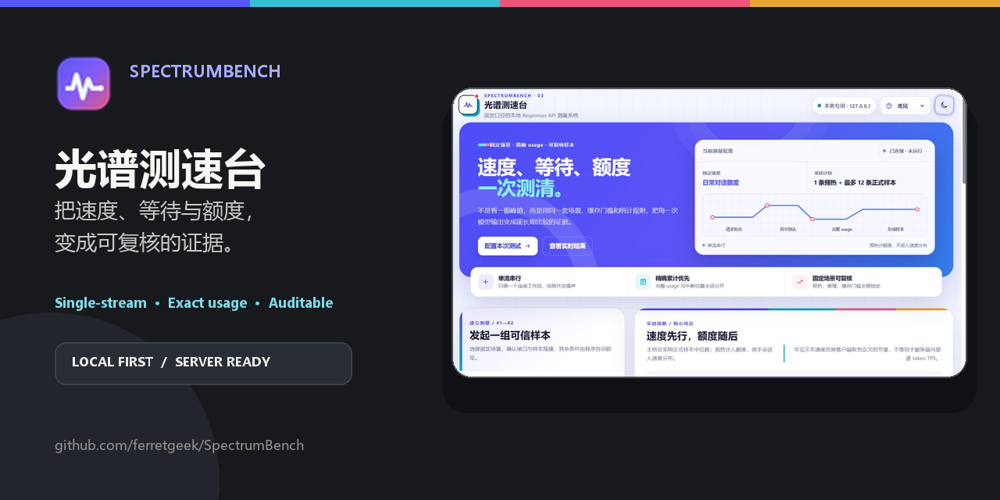
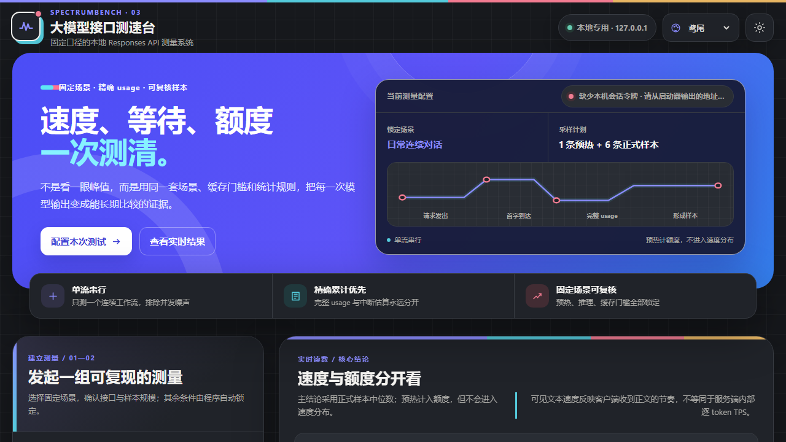

<div align="center">



# 光谱测速台 / SpectrumBench — Responses API 测速与用量

把速度、等待与额度，变成可复核的证据。  
Turn speed, latency, and token usage into evidence you can audit.

[](https://github.com/ferretgeek/SpectrumBench/actions/workflows/ci.yml)
[](https://github.com/ferretgeek/SpectrumBench/actions/workflows/codeql.yml)
[](https://ferretgeek.github.io/SpectrumBench/)
[](https://github.com/ferretgeek/SpectrumBench/releases)
[](LICENSE)

[简体中文](#简体中文) · [English](#english) · [在线预览](https://ferretgeek.github.io/SpectrumBench/) · [部署指南](docs/部署指南.md) · [测量方法](docs/测量方法.md)

</div>



## 简体中文

SpectrumBench 是一个本地优先的 Responses API 测速与额度观察台。它不追逐偶然峰值，而是锁定场景、推理、预热和缓存规则，以完整 `usage` 为准，分别呈现可见输出速度、端到端速度、首字延迟、缓存与 API 等效成本。

### 你会得到什么

- 三种固定单流场景：无缓存极限、日常连续对话、Codex 高缓存；不会把并发吞吐伪装成单请求速度。
- 实时看板、质量门禁、逐请求明细、历史可比性判断和一次性 JSON 报告。
- 完整 usage 与中断估算严格分开；预热会计入额度，但不进入正式速度分布。
- 鸢尾、青玉、晨曦三套浅色配色，以及背景精确为 `#17191d` 的全局暗色主题。
- Windows 一键脚本、本地 Python、Docker Compose 和 Linux systemd + SSH 隧道部署。

### 隐私与安全

API Key 和 Base URL 只在当前浏览器会话与服务进程内存中使用，不写入草稿、历史、报告或运行日志。服务默认仅监听 `127.0.0.1`；WebSocket 要求同源；远程上游必须使用 HTTPS；包含账号、查询参数或片段的接口地址会被拒绝。

这个工具会按你的操作向上游 API 发起真实请求，可能产生费用。自动化测试、Demo 和项目截图不调用真实模型。请先阅读[隐私说明](PRIVACY.md)与[测量方法](docs/测量方法.md)。

### 本地启动

需要 Python 3.10 或更高版本。

```powershell
python -m venv .venv
.\.venv\Scripts\python -m pip install -r requirements.txt
.\.venv\Scripts\python token_stress_test.py
```

Windows 也可以在安装依赖后双击 `一键启动.bat`；`一键结束服务.bat` 会先验证端口上的服务确实是 SpectrumBench，避免误结束其他程序。默认访问 [http://127.0.0.1:18976](http://127.0.0.1:18976)。

### Docker 与服务器

```powershell
Copy-Item .env.docker.example .env
docker compose up --build -d
```

Compose 只把端口映射到宿主机回环地址。远程服务器请通过 SSH 隧道访问：

```text
ssh -L 18976:127.0.0.1:18976 user@example.com
```

完整的 Docker、systemd、升级和备份步骤见[部署指南](docs/部署指南.md)。不要把含 API Key 的面板直接暴露到公网。

### 多端点命令行对比

为每个端点建立一个不会提交的 `*.local.txt`，依次写入 HTTPS 接口地址、API Key、模型名称三行，然后显式传入：

```powershell
.\.venv\Scripts\python benchmark_token_speed.py `
  --configs endpoint-a.local.txt endpoint-b.local.txt `
  --mode daily-dialogue --samples 6 --warmups 1
```

程序不会自动寻找凭据文件。结果只记录配置文件名、模型和测量数据，不记录 Key 或 Base URL。

### 定价边界

仓库内置的是标准服务层、输入不超过 272K token 的静态 API 等效价格快照，用于统一换算，不代表套餐账单。超长上下文、Batch、Flex、Priority 和区域处理不套用这张表；真实价格以 [OpenAI 官方定价](https://developers.openai.com/api/docs/pricing)为准。

## English

SpectrumBench is a local-first Responses API speed and token-usage workbench. Instead of celebrating a lucky peak, it locks the scenario, reasoning level, warm-up policy, and cache rules, then uses complete `usage` data to separate visible output speed, end-to-end speed, time to first token, caching, and API-equivalent cost.

### What you get

- Three locked, single-stream methods: uncached limit, daily conversation, and high-cache Codex. Concurrent throughput is never presented as single-request speed.
- A live dashboard, quality gates, per-request details, history comparability checks, and one-time JSON reports.
- Complete usage and interrupted estimates stay separate; warm-ups count toward usage but never enter the formal speed distribution.
- Iris, Jade, and Sunrise light palettes plus a global dark theme whose background is exactly `#17191d`.
- Windows launchers, local Python, Docker Compose, and Linux systemd + SSH tunnel deployment.

### Privacy and security

The API key and Base URL exist only in the current browser session and service-process memory. They are never written to drafts, history, reports, or runtime logs. The service binds to `127.0.0.1` by default, WebSockets are same-origin, remote upstreams must use HTTPS, and endpoint URLs containing identity, query, or fragment data are rejected.

The tool sends real API requests only when you start a run, which may incur charges. Automated tests, the demo, and project screenshots never call a live model. Read the [privacy note](PRIVACY.md) and [measurement method](docs/测量方法.md) first.

### Run locally

Python 3.10 or newer is required.

```powershell
python -m venv .venv
.\.venv\Scripts\python -m pip install -r requirements.txt
.\.venv\Scripts\python token_stress_test.py
```

On Windows, you can also run `一键启动.bat` after installing dependencies. `一键结束服务.bat` verifies that the listener is SpectrumBench before stopping it. Open [http://127.0.0.1:18976](http://127.0.0.1:18976).

### Docker and servers

```powershell
Copy-Item .env.docker.example .env
docker compose up --build -d
```

Compose maps the port to the host loopback interface only. On a remote server, use an SSH tunnel:

```text
ssh -L 18976:127.0.0.1:18976 user@example.com
```

See the [deployment guide](docs/部署指南.md) for Docker, systemd, upgrade, and backup steps. Never expose the credential-bearing panel directly to the public internet.

### Multi-endpoint CLI comparison

Create one ignored `*.local.txt` file per endpoint with three lines—HTTPS endpoint, API key, and model—then pass the files explicitly:

```powershell
.\.venv\Scripts\python benchmark_token_speed.py `
  --configs endpoint-a.local.txt endpoint-b.local.txt `
  --mode daily-dialogue --samples 6 --warmups 1
```

The program never auto-discovers credential files. Results contain configuration filenames, model names, and measurements, but not keys or Base URLs.

### Pricing boundary

The checked-in table is a static API-equivalent snapshot for the standard service tier with up to 272K input tokens. It is a comparison aid, not a subscription bill. Long context, Batch, Flex, Priority, and regional processing are outside this table; verify live rates on the [official OpenAI pricing page](https://developers.openai.com/api/docs/pricing).

## Project map / 项目导航

| Path | Purpose |
|---|---|
| `stress_tool/` | Measurement engine, FastAPI/WebSocket server, persistence allowlists, and dashboard |
| `token_stress_test.py` | Local/server launcher |
| `benchmark_token_speed.py` | Counterbalanced multi-endpoint CLI comparison |
| `pricing_table.json` | Auditable static API-equivalent pricing snapshot |
| `tests/` | Measurement, engine, privacy, URL, report, and server-security tests |
| `docs/` | Deployment, methodology, preview assets, and publication audit |

MIT © ferretgeek
